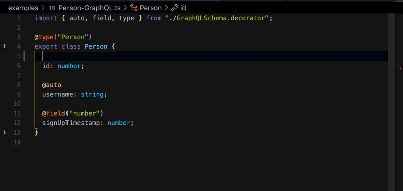

# decky

Use experimental decorators with zero runtime cost and without increasing your bundle size.

decky strives for full compatiblity with TypeScript, Prettier, and the rest of the JavaScript ecosystem.



## Installation

`decky` is an esbuild plugin.

```bash
npm install decky
```

In your esbuild configuration:

```ts
const { build } = require("esbuild");
const { load } = require("decky");

build({
  // ...rest of your esbuild config
  plugins: [await load()];
})
```

## Usage

The [`GraphQLSchema.decorator`](./examples/GraphQLSchema.decorator.ts) example lets you write GraphQL types inline with zero runtime overhead:

```ts
import { auto, field, type } from "./GraphQLSchema.decorator";

@type("Person")
export class Person {
  @field("ID", "user id number")
  id: number;

  @auto
  username: string;

  @field("number")
  signUpTimestamp: number;
}
```

At build-time, it outputs the GraphQL schema to a file:

```graphql
type Person {
  signUpTimestamp: number
  username: string
  # user id number
  id: ID
}
```

To the bundler, there are no decorators. They're removed at build-time.

```ts
export class Person {
  id: number;
  username: string;
  signUpTimestamp: number;
}
```

What if we wanted JSON Schema instead of GraphQL? If the interface was the same but you had a [`JSONSchema.decorator`](./examples/JSONSchema.decorator.ts):

```patch
+import { auto, field, type } from "./GraphQLSchema.decorator";
-import { auto, field, type } from "./JSONSchema.decorator";

@type("Person")
export class Person {
// ...rest of file

```

You'd get this:

```json
{
  "Person": {
    "signUpTimestamp": {
      "type": "number"
    },
    "username": {
      "type": "string"
    },
    "id": {
      "type": "number",
      "description": "user id number"
    }
  }
}
```

### Writing decorators

Decorators are run at build-time. This uses a handcrafted bespoke not-JavaScript AST. The syntax looks like decorators enough to fool TypeScript's type checker, but under the hood, its entirely different.

Decorator imports are removed during tree-shaking, leaving no trace.

By default, files that write new decorators need to end in any of these extensions:

- `.decorator.ts`
- `.decorator.tsx`
- `.decky.ts`
- `.decky.tsx`
- `.dec.ts`
- `.dec.tsx`

And it needs to export `decorators` which is an object where the `key` is the function name and the value is the decorator function (`property`, `propertyVoid` or `klass`).

#### Property Decorator:

With no arguments:

```ts
import { propertyVoid } from "decky";

// void means the decorator accepts no arguments from the code calling it
export const debugOnly = propertyVoid(() => {
  if (!process.env.DEBUG) {
    return "";
  }
});

export const decorators = { debugOnly };
```

You use it like this:

```ts
import { debugOnly } from "./debugOnly.decorator";

export class Task {
  @debugOnly
  shouldLog = true;

  run() {
    // ... code in here
  }
}
```

Then, when `!DEBUG`, Task is compiled as:

```ts
export class Task {
  run() {
    // ... code in here
  }
}
```

What we return in `property` or `propertyVoid` replaces from the `@` to the next two lines. If we don't return anything or return `undefined`, it just deletes the line containing the @ symbol.

You can use decky to edit code at build-time or for generating metadata for code.

#### Class Decorator:

TODO example

### Performance

TLDR: not bad

To log timings, set `process.env.DECKY_TIMINGS` to something truthy.

You can reproduce all the timings mentioned below by running `node build.js` in this project.

For simple files like the Propery Decorator `@debugOnly` example, the numbers look like this:

```bash
# How long it took to call the @debugOnly decorator
[decky] debugOnly.debugOnly(): 0.025ms
# How long it took to parse the section of the file relevant to @debugOnly
[decky] -> debugOnly: examples/debugOnlyExample.ts: 0.108ms
# How long it took ducky to process the entire file end-to-end
[decky] ./examples/debugOnlyExample.ts: 0.288ms
```

Since `@debugOnly` does very little, its a reasonable approximation of what the cost of `ducky` itself is. End-to-end it took `0.288ms` for decky to process the file. That's honestly faster than I expected at the time of writing.

This is a small file, but what about a larger one?

```bash
[decky] JSONSchema.field(number): 0.162ms
[decky] -> field: examples/JSONSchema.ts: 0.336ms
[decky] JSONSchema.auto(): 0.059ms
[decky] -> auto: examples/JSONSchema.ts: 0.131ms
[decky] JSONSchema.field(ID, user id number): 0.02ms
[decky] -> field: examples/JSONSchema.ts: 0.107ms
Saved JSON schema to /Users/jarredsumner/Code/decky/examples/JSONSchema.json
[decky] JSONSchema.type(Person): 1.07ms
[decky] ./examples/JSONSchema.ts: 2.932ms
```

For the JSONSchema example, it took `2.932ms`. But, some of that was writing and stringifying JSON – code specific to the JSONSchema example (rather than decky). If we subtract all those function calls:

```
[decky] JSONSchema.field(number): 0.162ms
[decky] JSONSchema.field(ID, user id number): 0.02ms
[decky] JSONSchema.type(Person): 1.07ms
```

That means it took `2.932ms` - `1.252ms`, or: `1.68ms` for one file with several decorators.

This can be optimized some, feel free to open an issue if you're running into perf issues. Also note that decky eagerly ignores files that don't have any decorators in them.

## Changelog

- `1.1.0`: Rewrite parsing, add logging, fix multiple decorators for same property
